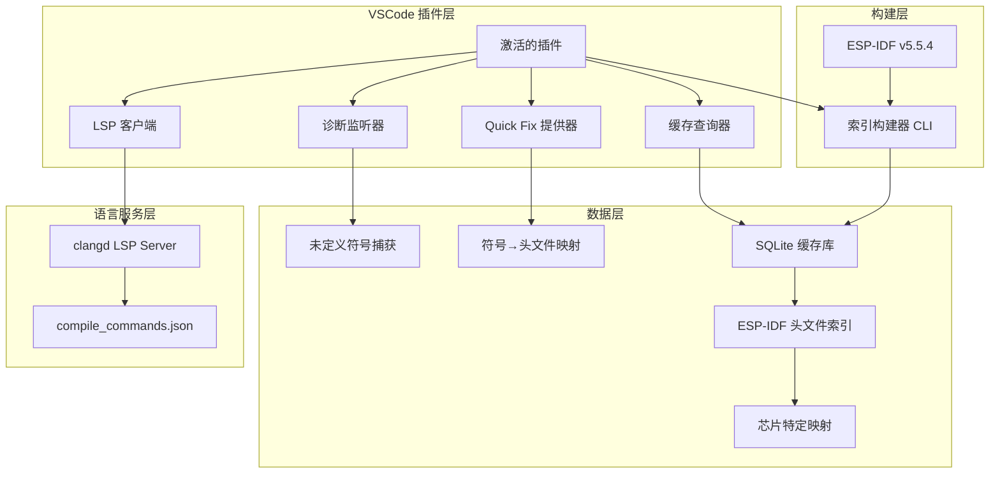

好的，我来为你整理一个完整的、可实施的方案。这个方案将结合 `clangd` LSP 和本地 SQLite 缓存库，提供智能的快速导入功能。

## 🎯 完整方案架构

### 系统架构图



### 技术栈选择

| 组件 | 技术选型 | 理由 |
|------|---------|------|
| 插件框架 | VSCode Extension API | 原生支持 |
| LSP 集成 | `vscode-languageclient` | 成熟的 LSP 客户端库 |
| 本地缓存 | SQLite3 | 轻量级、查询快、无需服务 |
| 索引构建 | Python + sqlite3 | 快速开发、跨平台 |
| 配置管理 | VSCode Settings | 用户可配置芯片类型 |

## 📁 项目结构

```
esp-idf-include-assistant/
├── .vscode/
│   ├── launch.json          # 调试配置
│   └── tasks.json           # 构建任务
├── src/
│   ├── extension.ts         # 插件入口
│   ├── lsp/
│   │   └── clangdClient.ts  # clangd LSP 客户端封装
│   ├── diagnostics/
│   │   └── errorMatcher.ts  # 诊断信息匹配器
│   ├── quickfix/
│   │   └── includeFixer.ts  # Quick Fix 提供器
│   ├── cache/
│   │   ├── database.ts      # SQLite 数据库操作
│   │   └── symbolIndex.ts   # 符号索引查询
│   └── config/
│       └── settings.ts      # 配置管理
├── scripts/
│   ├── build_index.py       # 索引构建脚本
│   └── scan_headers.py      # 头文件扫描器
├── assets/
│   └── icons/               # 插件图标
├── package.json
├── tsconfig.json
└── README.md
```

## 🔧 核心实现代码

### 1. 插件入口 (`src/extension.ts`)

```typescript
import * as vscode from 'vscode';
import { ClangdLSPClient } from './lsp/clangdClient';
import { IncludeQuickFixProvider } from './quickfix/includeFixer';
import { SymbolCache } from './cache/symbolIndex';
import { ConfigManager } from './config/settings';

export async function activate(context: vscode.ExtensionContext) {
    console.log('ESP-IDF Include Helper 已激活');
    
    // 初始化配置
    const config = new ConfigManager();
    
    // 初始化符号缓存
    const cache = new SymbolCache(context.globalStoragePath);
    await cache.initialize();
    
    // 初始化 clangd LSP 客户端
    const lspClient = new ClangdLSPClient(context, config);
    await lspClient.start();
    
    // 注册 Quick Fix 提供器
    const quickFixProvider = new IncludeQuickFixProvider(cache, lspClient, config);
    context.subscriptions.push(
        vscode.languages.registerCodeActionsProvider(
            [{ scheme: 'file', language: 'c' }, { scheme: 'file', language: 'cpp' }],
            quickFixProvider,
            { providedCodeActionKinds: [vscode.CodeActionKind.QuickFix] }
        )
    );
    
    // 监听诊断信息（clangd 产生的错误）
    const diagnosticListener = vscode.languages.onDidChangeDiagnostics((event) => {
        for (const uri of event.uris) {
            const diagnostics = vscode.languages.getDiagnostics(uri);
            const undefinedSymbols = diagnostics.filter(d => 
                d.message.includes('undeclared') || 
                d.message.includes('unknown type') ||
                d.message.match(/use of undeclared identifier/)
            );
            
            // 可选：在状态栏显示提示
            if (undefinedSymbols.length > 0) {
                vscode.window.setStatusBarMessage(
                    `发现 ${undefinedSymbols.length} 个未定义符号，按 Alt+Enter 快速添加头文件`,
                    3000
                );
            }
        }
    });
    context.subscriptions.push(diagnosticListener);
    
    // 注册手动触发索引重建命令
    context.subscriptions.push(
        vscode.commands.registerCommand('esp-idf-include-assistant.rebuildCache', async () => {
            await vscode.window.withProgress({
                location: vscode.ProgressLocation.Notification,
                title: '正在重建 ESP-IDF 符号缓存...',
                cancellable: false
            }, async (progress) => {
                progress.report({ increment: 0, message: '扫描头文件...' });
                await cache.rebuild(config.idfPath, config.chipTarget);
                progress.report({ increment: 100, message: '完成！' });
                vscode.window.showInformationMessage('符号缓存重建完成');
            });
        })
    );
    
    // 注册查看缓存状态命令
    context.subscriptions.push(
        vscode.commands.registerCommand('esp-idf-include-assistant.showCacheStatus', () => {
            const status = cache.getStatus();
            vscode.window.showInformationMessage(
                `缓存状态: ${status.symbolCount} 个符号, 芯片: ${status.chipTarget}, 版本: ${status.idfVersion}`
            );
        })
    );
}

export function deactivate() {
    console.log('ESP-IDF Include Helper 已停用');
}
```

### 2. Quick Fix 提供器 (`src/quickfix/includeFixer.ts`)

```typescript
import * as vscode from 'vscode';
import { SymbolCache } from '../cache/symbolIndex';
import { ClangdLSPClient } from '../lsp/clangdClient';
import { ConfigManager } from '../config/settings';

export class IncludeQuickFixProvider implements vscode.CodeActionProvider {
    constructor(
        private cache: SymbolCache,
        private lspClient: ClangdLSPClient,
        private config: ConfigManager
    ) {}
    
    public async provideCodeActions(
        document: vscode.TextDocument,
        range: vscode.Range | vscode.Selection,
        context: vscode.CodeActionContext,
        token: vscode.CancellationToken
    ): Promise<vscode.CodeAction[]> {
        const actions: vscode.CodeAction[] = [];
        
        // 只处理 C/C++ 文件
        if (!['c', 'cpp', 'h', 'hpp'].includes(document.languageId)) {
            return actions;
        }
        
        // 分析每个诊断信息
        for (const diagnostic of context.diagnostics) {
            // 匹配未定义符号的错误
            const symbolName = this.extractUndefinedSymbol(diagnostic.message);
            if (!symbolName) continue;
            
            // 在缓存中查找符号对应的头文件
            const headerInfo = await this.cache.findSymbol(symbolName);
            if (!headerInfo) continue;
            
            // 检查头文件是否已包含
            if (this.isHeaderIncluded(document, headerInfo.header)) {
                continue;
            }
            
            // 创建 Quick Fix
            const action = new vscode.CodeAction(
                `添加 #include "${headerInfo.header}" (${symbolName})`,
                vscode.CodeActionKind.QuickFix
            );
            
            action.diagnostics = [diagnostic];
            action.isPreferred = true;
            
            // 添加文档编辑操作
            action.edit = new vscode.WorkspaceEdit();
            const insertPosition = this.getIncludeInsertPosition(document);
            action.edit.insert(document.uri, insertPosition, `#include "${headerInfo.header}"\n`);
            
            // 添加命令（可选，用于更复杂的处理）
            action.command = {
                command: 'esp-idf-include-assistant.onIncludeAdded',
                title: '记录包含操作',
                arguments: [symbolName, headerInfo.header]
            };
            
            actions.push(action);
            
            // 如果有多个候选头文件，创建备选方案
            const alternatives = await this.cache.findAlternatives(symbolName);
            for (const alt of alternatives.slice(0, 3)) {
                if (this.isHeaderIncluded(document, alt.header)) continue;
                
                const altAction = new vscode.CodeAction(
                    `添加 #include "${alt.header}" (备选)`,
                    vscode.CodeActionKind.QuickFix
                );
                altAction.diagnostics = [diagnostic];
                altAction.edit = new vscode.WorkspaceEdit();
                altAction.edit.insert(document.uri, insertPosition, `#include "${alt.header}"\n`);
                actions.push(altAction);
            }
        }
        
        return actions;
    }
    
    private extractUndefinedSymbol(message: string): string | null {
        // 匹配 clangd 的未定义符号错误格式
        const patterns = [
            /use of undeclared identifier '(\w+)'/,
            /unknown type name '(\w+)'/,
            /implicit declaration of function '(\w+)'/,
            /'(\w+)' undeclared/,
            /undefined identifier '(\w+)'/
        ];
        
        for (const pattern of patterns) {
            const match = message.match(pattern);
            if (match) return match[1];
        }
        return null;
    }
    
    private isHeaderIncluded(document: vscode.TextDocument, headerName: string): boolean {
        const text = document.getText();
        // 匹配 #include "headerName" 或 #include <headerName>
        const includePattern = new RegExp(`#include\\s+[<"]${this.escapeRegex(headerName)}[>"]`);
        return includePattern.test(text);
    }
    
    private getIncludeInsertPosition(document: vscode.TextDocument): vscode.Position {
        // 在文件开头查找最后一个 #include 的位置
        const text = document.getText();
        const lines = text.split('\n');
        
        let lastIncludeLine = -1;
        for (let i = 0; i < lines.length; i++) {
            if (lines[i].trim().startsWith('#include')) {
                lastIncludeLine = i;
            } else if (lastIncludeLine !== -1 && !lines[i].trim().startsWith('#') && lines[i].trim() !== '') {
                // 遇到非预处理指令的空行或代码，停止
                break;
            }
        }
        
        if (lastIncludeLine !== -1) {
            return new vscode.Position(lastIncludeLine + 1, 0);
        }
        
        // 如果没有找到 #include，放在文件开头
        return new vscode.Position(0, 0);
    }
    
    private escapeRegex(str: string): string {
        return str.replace(/[.*+?^${}()|[\]\\]/g, '\\$&');
    }
}
```

### 3. 符号缓存系统 (`src/cache/symbolIndex.ts`)

```typescript
import * as vscode from 'vscode';
import * as path from 'path';
import * as fs from 'fs';
import * as sqlite3 from 'sqlite3';
import { promisify } from 'util';

export interface SymbolInfo {
    name: string;
    header: string;
    fullPath: string;
    type: string;  // 'function', 'macro', 'typedef', 'enum', 'struct'
    chipTarget: string;  // 'esp32', 'esp32s3', 'esp32c3', etc.
    idfVersion: string;
    lineNumber: number;
    description?: string;
}

export interface HeaderInfo {
    name: string;
    symbols: string[];
    includes: string[];
}

export class SymbolCache {
    private db: sqlite3.Database | null = null;
    private dbPath: string;
    
    constructor(storagePath: string) {
        this.dbPath = path.join(storagePath, 'symbols.db');
        // 确保存储目录存在
        if (!fs.existsSync(storagePath)) {
            fs.mkdirSync(storagePath, { recursive: true });
        }
    }
    
    async initialize(): Promise<void> {
        return new Promise((resolve, reject) => {
            this.db = new sqlite3.Database(this.dbPath, (err) => {
                if (err) {
                    reject(err);
                    return;
                }
                this.createTables();
                resolve();
            });
        });
    }
    
    private createTables(): void {
        if (!this.db) return;
        
        // 符号表
        this.db.run(`
            CREATE TABLE IF NOT EXISTS symbols (
                id INTEGER PRIMARY KEY AUTOINCREMENT,
                name TEXT NOT NULL,
                header TEXT NOT NULL,
                full_path TEXT,
                type TEXT,
                chip_target TEXT,
                idf_version TEXT,
                line_number INTEGER,
                description TEXT,
                UNIQUE(name, chip_target, idf_version)
            )
        `);
        
        // 头文件表
        this.db.run(`
            CREATE TABLE IF NOT EXISTS headers (
                id INTEGER PRIMARY KEY AUTOINCREMENT,
                name TEXT UNIQUE NOT NULL,
                full_path TEXT,
                includes TEXT,  -- JSON 数组
                symbols TEXT    -- JSON 数组
            )
        `);
        
        // 创建索引
        this.db.run(`CREATE INDEX IF NOT EXISTS idx_symbol_name ON symbols(name)`);
        this.db.run(`CREATE INDEX IF NOT EXISTS idx_symbol_chip ON symbols(chip_target)`);
        this.db.run(`CREATE INDEX IF NOT EXISTS idx_symbol_header ON symbols(header)`);
        
        // 创建模糊搜索的虚拟表（使用 FTS5 全文搜索）
        this.db.run(`
            CREATE VIRTUAL TABLE IF NOT EXISTS symbols_fts USING fts5(
                name, header, description, 
                content=symbols,
                content_rowid=id
            )
        `);
        
        // 创建触发器同步 FTS 表
        this.db.run(`
            CREATE TRIGGER IF NOT EXISTS symbols_ai AFTER INSERT ON symbols BEGIN
                INSERT INTO symbols_fts(rowid, name, header, description) 
                VALUES (new.id, new.name, new.header, new.description);
            END
        `);
    }
    
    async rebuild(idfPath: string, chipTarget: string): Promise<void> {
        // 调用 Python 脚本构建索引
        const scriptPath = path.join(__dirname, '../../scripts/build_index.py');
        const pythonPath = 'python';  // 或使用配置的 Python 路径
        
        return new Promise((resolve, reject) => {
            const process = require('child_process').spawn(pythonPath, [
                scriptPath,
                '--idf-path', idfPath,
                '--chip-target', chipTarget,
                '--output', this.dbPath
            ]);
            
            process.stdout.on('data', (data: Buffer) => {
                console.log(`索引构建: ${data.toString()}`);
            });
            
            process.stderr.on('data', (data: Buffer) => {
                console.error(`索引构建错误: ${data.toString()}`);
            });
            
            process.on('close', (code: number) => {
                if (code === 0) {
                    resolve();
                } else {
                    reject(new Error(`索引构建失败，退出码: ${code}`));
                }
            });
        });
    }
    
    async findSymbol(symbolName: string): Promise<SymbolInfo | null> {
        if (!this.db) return null;
        
        const config = vscode.workspace.getConfiguration('espIdfIncludeAssistant');
        const chipTarget = config.get<string>('chipTarget') || 'esp32';
        
        return new Promise((resolve, reject) => {
            this.db!.get(
                `SELECT * FROM symbols 
                 WHERE name = ? AND chip_target = ? 
                 ORDER BY idf_version DESC LIMIT 1`,
                [symbolName, chipTarget],
                (err, row: any) => {
                    if (err) {
                        reject(err);
                    } else if (row) {
                        resolve({
                            name: row.name,
                            header: row.header,
                            fullPath: row.full_path,
                            type: row.type,
                            chipTarget: row.chip_target,
                            idfVersion: row.idf_version,
                            lineNumber: row.line_number,
                            description: row.description
                        });
                    } else {
                        resolve(null);
                    }
                }
            );
        });
    }
    
    async findAlternatives(symbolName: string, limit: number = 5): Promise<SymbolInfo[]> {
        if (!this.db) return [];
        
        const config = vscode.workspace.getConfiguration('espIdfIncludeAssistant');
        const chipTarget = config.get<string>('chipTarget') || 'esp32';
        
        return new Promise((resolve, reject) => {
            this.db!.all(
                `SELECT * FROM symbols 
                 WHERE name = ? AND chip_target != ? 
                 ORDER BY idf_version DESC LIMIT ?`,
                [symbolName, chipTarget, limit],
                (err, rows: any[]) => {
                    if (err) {
                        reject(err);
                    } else {
                        resolve(rows.map(row => ({
                            name: row.name,
                            header: row.header,
                            fullPath: row.full_path,
                            type: row.type,
                            chipTarget: row.chip_target,
                            idfVersion: row.idf_version,
                            lineNumber: row.line_number,
                            description: row.description
                        })));
                    }
                }
            );
        });
    }
    
    async fuzzySearch(query: string, limit: number = 10): Promise<SymbolInfo[]> {
        if (!this.db) return [];
        
        return new Promise((resolve, reject) => {
            this.db!.all(
                `SELECT s.* FROM symbols s
                 JOIN symbols_fts fts ON s.id = fts.rowid
                 WHERE symbols_fts MATCH ? 
                 ORDER BY rank LIMIT ?`,
                [`${query}*`, limit],
                (err, rows: any[]) => {
                    if (err) {
                        reject(err);
                    } else {
                        resolve(rows.map(row => ({
                            name: row.name,
                            header: row.header,
                            fullPath: row.full_path,
                            type: row.type,
                            chipTarget: row.chip_target,
                            idfVersion: row.idf_version,
                            lineNumber: row.line_number,
                            description: row.description
                        })));
                    }
                }
            );
        });
    }
    
    getStatus(): { symbolCount: number; chipTarget: string; idfVersion: string } {
        if (!this.db) {
            return { symbolCount: 0, chipTarget: 'unknown', idfVersion: 'unknown' };
        }
        
        let symbolCount = 0;
        let chipTarget = 'unknown';
        let idfVersion = 'unknown';
        
        this.db.get('SELECT COUNT(*) as count FROM symbols', (err, row: any) => {
            if (!err) symbolCount = row.count;
        });
        
        const config = vscode.workspace.getConfiguration('espIdfIncludeAssistant');
        chipTarget = config.get<string>('chipTarget') || 'esp32';
        idfVersion = config.get<string>('idfVersion') || 'v5.5.4';
        
        return { symbolCount, chipTarget, idfVersion };
    }
    
    async close(): Promise<void> {
        if (this.db) {
            await promisify(this.db.close.bind(this.db))();
            this.db = null;
        }
    }
}
```

### 4. 索引构建脚本 (`scripts/build_index.py`)

```python
#!/usr/bin/env python3
"""
ESP-IDF 符号索引构建器
扫描 ESP-IDF 头文件，构建 SQLite 符号缓存
"""

import os
import re
import json
import sqlite3
import argparse
from pathlib import Path
from typing import Dict, List, Set, Optional
from dataclasses import dataclass, asdict
from concurrent.futures import ThreadPoolExecutor, as_completed

@dataclass
class SymbolInfo:
    name: str
    header: str
    full_path: str
    type: str
    chip_target: str
    idf_version: str
    line_number: int
    description: str

class ESPIDFIndexBuilder:
    def __init__(self, idf_path: str, chip_target: str, idf_version: str):
        self.idf_path = Path(idf_path)
        self.components_path = self.idf_path / "components"
        self.chip_target = chip_target
        self.idf_version = idf_version
        self.symbols: Dict[str, SymbolInfo] = {}
        
        # 芯片特定的头文件路径映射
        self.chip_specific_paths = {
            'esp32': ['esp32/include', 'hal/esp32/include', 'soc/esp32/include'],
            'esp32s3': ['esp32s3/include', 'hal/esp32s3/include', 'soc/esp32s3/include'],
            'esp32c3': ['esp32c3/include', 'hal/esp32c3/include', 'soc/esp32c3/include'],
            'esp32c6': ['esp32c6/include', 'hal/esp32c6/include', 'soc/esp32c6/include'],
        }
        
    def build_index(self) -> Dict[str, SymbolInfo]:
        """构建完整的符号索引"""
        print(f"开始扫描 ESP-IDF {self.idf_version} 头文件...")
        print(f"目标芯片: {self.chip_target}")
        print(f"IDF 路径: {self.idf_path}")
        
        # 收集所有需要扫描的头文件
        headers = self.collect_headers()
        print(f"找到 {len(headers)} 个头文件")
        
        # 并行解析头文件
        with ThreadPoolExecutor(max_workers=8) as executor:
            futures = {executor.submit(self.parse_header, h): h for h in headers}
            for i, future in enumerate(as_completed(futures)):
                if i % 100 == 0:
                    print(f"进度: {i}/{len(headers)}")
                symbols = future.result()
                for sym in symbols:
                    self.symbols[sym.name] = sym
        
        print(f"提取到 {len(self.symbols)} 个符号")
        return self.symbols
    
    def collect_headers(self) -> List[Path]:
        """收集所有需要扫描的头文件"""
        headers = []
        
        # 扫描所有组件的 include 目录
        for component_dir in self.components_path.iterdir():
            if not component_dir.is_dir():
                continue
                
            # 标准 include 目录
            include_dir = component_dir / "include"
            if include_dir.exists():
                headers.extend(include_dir.rglob("*.h"))
            
            # 芯片特定的 include 目录
            for chip_path in self.chip_specific_paths.get(self.chip_target, []):
                chip_include = component_dir / chip_path
                if chip_include.exists():
                    headers.extend(chip_include.rglob("*.h"))
        
        # 去重
        return list(set(headers))
    
    def parse_header(self, header_path: Path) -> List[SymbolInfo]:
        """解析单个头文件，提取符号定义"""
        symbols = []
        
        try:
            with open(header_path, 'r', encoding='utf-8', errors='ignore') as f:
                content = f.read()
                lines = content.split('\n')
            
            # 各种符号的正则表达式模式
            patterns = [
                # 函数声明
                (r'^\s*(\w+(?:\s*\*\s*)?)\s+(\w+)\s*\([^)]*\)\s*;', 'function'),
                # typedef 类型定义
                (r'typedef\s+[^;]+\s+(\w+)\s*;', 'typedef'),
                # 枚举类型
                (r'typedef\s+enum\s*\{[^}]*\}\s*(\w+)\s*;', 'enum'),
                # 结构体类型
                (r'typedef\s+struct\s*\{[^}]*\}\s*(\w+)\s*;', 'struct'),
                # 宏定义（全大写）
                (r'#define\s+([A-Z_][A-Z0-9_]*)(?:\s|$)', 'macro'),
                # esp_err_t 错误码
                (r'#define\s+(ESP_ERR_[A-Z_]+)\s+', 'macro'),
                # ESP-IDF 特有的芯片相关函数
                (r'^\s*(\w+(?:\s*\*\s*)?)\s+(esp_\w+)\s*\([^)]*\)\s*;', 'function'),
                (r'^\s*(\w+(?:\s*\*\s*)?)\s+(nvs_\w+)\s*\([^)]*\)\s*;', 'function'),
                (r'^\s*(\w+(?:\s*\*\s*)?)\s+(gpio_\w+)\s*\([^)]*\)\s*;', 'function'),
                (r'^\s*(\w+(?:\s*\*\s*)?)\s+(wifi_\w+)\s*\([^)]*\)\s*;', 'function'),
            ]
            
            for pattern, sym_type in patterns:
                for match in re.finditer(pattern, content, re.MULTILINE):
                    # 提取符号名
                    symbol_name = match.group(1) if len(match.groups()) > 0 else match.group(0)
                    if len(match.groups()) >= 2:
                        symbol_name = match.group(2)
                    
                    # 提取行号
                    line_num = content[:match.start()].count('\n') + 1
                    
                    # 提取描述（如果有注释）
                    description = self.extract_comment_before(lines, line_num - 1)
                    
                    symbol = SymbolInfo(
                        name=symbol_name,
                        header=header_path.name,
                        full_path=str(header_path.relative_to(self.idf_path)),
                        type=sym_type,
                        chip_target=self.chip_target,
                        idf_version=self.idf_version,
                        line_number=line_num,
                        description=description
                    )
                    symbols.append(symbol)
                    
        except Exception as e:
            print(f"解析 {header_path} 时出错: {e}")
        
        return symbols
    
    def extract_comment_before(self, lines: List[str], line_index: int) -> str:
        """提取符号前面的注释作为描述"""
        description = ""
        i = line_index - 1
        comment_lines = []
        
        while i >= 0 and (lines[i].strip().startswith('//') or lines[i].strip().startswith('/*')):
            comment_lines.insert(0, lines[i].strip())
            i -= 1
        
        if comment_lines:
            description = ' '.join(comment_lines)
            # 清理注释标记
            description = re.sub(r'[/\*]', '', description).strip()
        
        return description
    
    def save_to_sqlite(self, db_path: str):
        """保存索引到 SQLite 数据库"""
        conn = sqlite3.connect(db_path)
        cursor = conn.cursor()
        
        # 清空现有数据
        cursor.execute("DELETE FROM symbols")
        
        # 批量插入
        symbols_data = []
        for symbol in self.symbols.values():
            symbols_data.append((
                symbol.name,
                symbol.header,
                symbol.full_path,
                symbol.type,
                symbol.chip_target,
                symbol.idf_version,
                symbol.line_number,
                symbol.description
            ))
        
        cursor.executemany('''
            INSERT OR REPLACE INTO symbols 
            (name, header, full_path, type, chip_target, idf_version, line_number, description)
            VALUES (?, ?, ?, ?, ?, ?, ?, ?)
        ''', symbols_data)
        
        conn.commit()
        conn.close()
        print(f"已保存 {len(symbols_data)} 个符号到 {db_path}")

def main():
    parser = argparse.ArgumentParser(description='构建 ESP-IDF 符号索引')
    parser.add_argument('--idf-path', required=True, help='ESP-IDF 安装路径')
    parser.add_argument('--chip-target', default='esp32', help='目标芯片类型')
    parser.add_argument('--idf-version', default='v5.5.4', help='ESP-IDF 版本')
    parser.add_argument('--output', default='symbols.db', help='输出数据库路径')
    
    args = parser.parse_args()
    
    builder = ESPIDFIndexBuilder(args.idf_path, args.chip_target, args.idf_version)
    builder.build_index()
    builder.save_to_sqlite(args.output)

if __name__ == '__main__':
    main()
```

### 5. 插件配置文件 (`package.json`)

```json
{
    "name": "esp-idf-include-assistant",
    "displayName": "ESP-IDF Include Helper",
    "description": "智能检测未定义符号并快速添加对应的头文件",
    "version": "0.1.0",
    "publisher": "yourname",
    "engines": {
        "vscode": "^1.85.0"
    },
    "categories": [
        "Programming Languages",
        "Other"
    ],
    "activationEvents": [
        "onLanguage:c",
        "onLanguage:cpp",
        "workspaceContains:**/CMakeLists.txt"
    ],
    "main": "./out/extension.js",
    "contributes": {
        "commands": [
            {
                "command": "esp-idf-include-assistant.rebuildCache",
                "title": "ESP-IDF: 重建符号缓存"
            },
            {
                "command": "esp-idf-include-assistant.showCacheStatus",
                "title": "ESP-IDF: 查看缓存状态"
            }
        ],
        "configuration": {
            "title": "ESP-IDF Include Helper",
            "properties": {
                "espIdfIncludeAssistant.idfPath": {
                    "type": "string",
                    "default": "",
                    "description": "ESP-IDF 安装路径"
                },
                "espIdfIncludeAssistant.chipTarget": {
                    "type": "string",
                    "enum": ["esp32", "esp32s3", "esp32c3", "esp32c6", "esp32h2"],
                    "default": "esp32",
                    "description": "目标芯片类型"
                },
                "espIdfIncludeAssistant.idfVersion": {
                    "type": "string",
                    "default": "v5.5.4",
                    "description": "ESP-IDF 版本"
                },
                "espIdfIncludeAssistant.enableQuickFix": {
                    "type": "boolean",
                    "default": true,
                    "description": "启用快速修复功能"
                },
                "espIdfIncludeAssistant.autoDetectChip": {
                    "type": "boolean",
                    "default": true,
                    "description": "从项目配置自动检测芯片类型"
                }
            }
        }
    },
    "extensionDependencies": [
        "llvm-vs-code-extensions.vscode-clangd"
    ],
    "scripts": {
        "compile": "tsc -p ./",
        "watch": "tsc -watch -p ./",
        "package": "vsce package"
    },
    "devDependencies": {
        "@types/vscode": "^1.85.0",
        "@types/node": "^20.x",
        "@types/sqlite3": "^3.1.8",
        "typescript": "^5.0.0",
        "@vscode/vsce": "^2.22.0"
    },
    "dependencies": {
        "vscode-languageclient": "^9.0.1",
        "sqlite3": "^5.1.6"
    }
}
```

## 📋 使用流程

### 1. 首次安装配置

```bash
# 1. 安装 clangd 扩展（VSCode 市场）
# 2. 确保 ESP-IDF 已安装并配置环境变量
# 3. 在项目根目录生成 compile_commands.json
cd your-esp-project
idf.py reconfigure

# 4. 在 VSCode 设置中配置插件
# - IDF 路径: D:/programs-dev/Espressif/frameworks/esp-idf-v5.5.4
# - 芯片类型: esp32s3
# - 启用快速修复
```

### 2. 重建索引（首次使用或 IDF 更新后）

```bash
# 方法1: 通过命令面板
Ctrl+Shift+P -> "ESP-IDF: 重建符号缓存"

# 方法2: 手动运行脚本
python scripts/build_index.py \
  --idf-path "D:/programs-dev/Espressif/frameworks/esp-idf-v5.5.4" \
  --chip-target esp32s3 \
  --output ~/.esp-idf-include-assistant/symbols.db
```

### 3. 日常使用

1. 编写代码时，如果使用了未包含头文件的函数
2. `clangd` 会在代码下方显示红色波浪线
3. 按 `Alt+Enter` 或点击灯泡图标
4. 选择"添加 #include \"xxx.h\""选项
5. 头文件自动添加到文件顶部

## ⚠️ 注意事项

### 关于 LSP 与本地缓存的互斥问题

**两者并不互斥，可以协同工作：**

| 方案 | 作用 | 使用场景 |
|------|------|---------|
| **clangd LSP** | 实时解析当前文件，检测错误 | 日常编码时的错误检测 |
| **本地 SQLite 缓存** | 快速查询符号→头文件的映射 | Quick Fix 时提供头文件建议 |

**优先级处理：**

1. 优先使用 clangd 提供的诊断信息（更准确）
2. 仅当 clangd 无法提供建议时，回退到本地缓存
3. 本地缓存作为补充数据源

```typescript
// 在 Quick Fix 中的优先级逻辑
async getIncludeSuggestions(symbolName: string, document: vscode.TextDocument) {
    // 1. 尝试从 clangd 获取（通过 LSP 查询）
    const clangdSuggestions = await this.lspClient.getIncludeSuggestions(symbolName);
    if (clangdSuggestions.length > 0) {
        return clangdSuggestions;
    }
    
    // 2. 回退到本地缓存
    const cacheSuggestions = await this.cache.findSymbol(symbolName);
    if (cacheSuggestions) {
        return [cacheSuggestions];
    }
    
    // 3. 模糊搜索
    return await this.cache.fuzzySearch(symbolName);
}
```

这个完整方案可以直接实施。需要我详细说明某个部分的实现细节吗？
